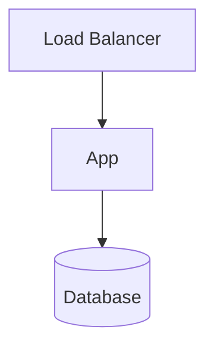

---
# Copy into _real-projects/, e.g. _real-projects/redis-oom-incident.md
title: Incident Title
nav_order: 1
description: One-line summary of the incident and its impact.
type: case-study
difficulty: advanced
last_updated: 2026-07-17
tags: [incident, postmortem]
related:
  - title: Related concept
    url: /devops/
references:
  - title: Runbook
    url: "https://example.com"
---

## Problem

What broke, and the business/user impact.

## Environment

Stack, versions, topology, scale.

## Symptoms

What was observed (alerts, errors, metrics).

## Investigation

The debugging trail, step by step.

## Root Cause

The actual cause, stated plainly.

## Fix

What resolved it.

## Commands Used

```bash
# the commands run during diagnosis and remediation
```

## Architecture Diagram



## Lessons Learned

What we now know.

## Prevention

Guardrails, alerts, tests, or process changes added.

## Related Concepts

Links to relevant docs.

## References

External links, tickets, dashboards.
