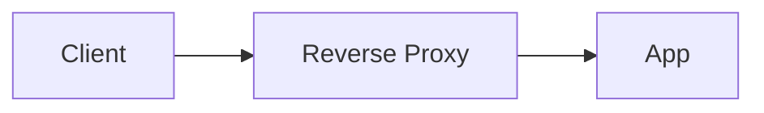

---
# Copy this file into a collection folder, e.g. _linux/ssh-hardening.md
title: Page Title
nav_order: 1                 # controls sidebar + section ordering
description: One-line summary shown under the title and in search.
difficulty: intermediate     # beginner | intermediate | advanced
last_updated: 2026-07-17
tags: [ssh, security]
prerequisites:
  - title: Linux basics
    url: /linux/
related:
  - title: Networking
    url: /networking/
references:
  - title: Official docs
    url: "https://example.com"
---

<!-- The layout renders the H1 title, meta row, prerequisites, related & references,
     TOC, and "Edit this page" automatically. Start the body at "## ". -->

## Overview

Short framing of what this page covers.

## Why it matters



## Architecture



## Examples

Worked example(s).

## Commands

```bash
# annotated commands
```

## Common mistakes

<div class="callout callout-mistake">
  <div class="callout-title">Common mistake</div>
  <ul><li>Pitfall one.</li><li>Pitfall two.</li></ul>
</div>

## Interview questions

<div class="callout callout-interview">
  <div class="callout-title">Interview questions</div>
  <ol><li>Question one?</li><li>Question two?</li></ol>
</div>
